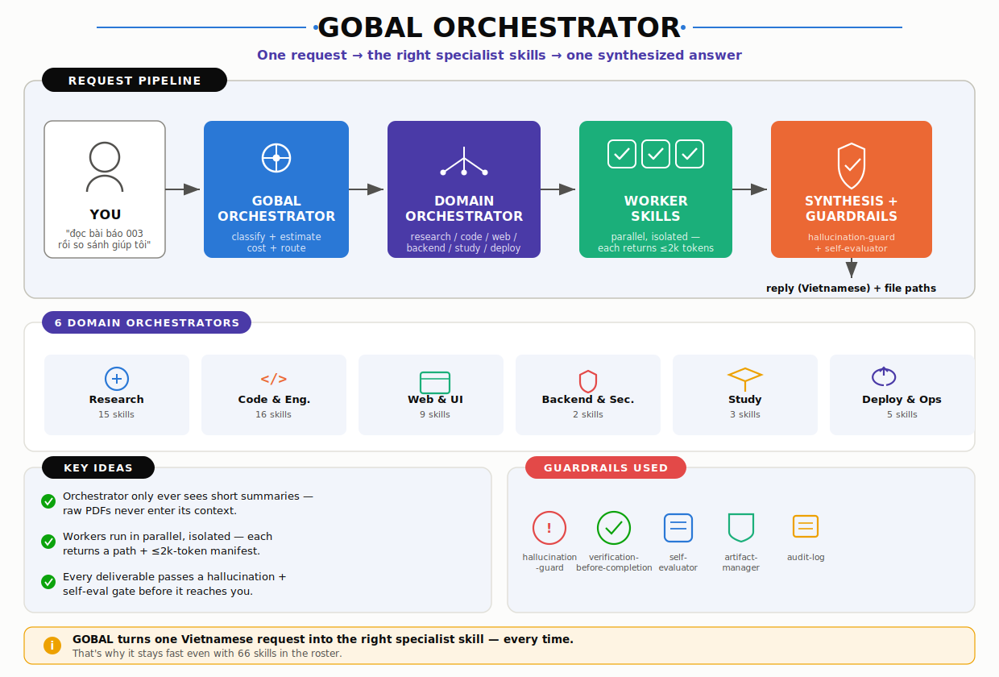

# GOBAL Agent Skills

A curated collection of **66 specialist skills** for [Claude Code](https://claude.ai/claude-code) — covering academic research, software engineering, UI/UX design, career prep, and operations. Each skill is a self-contained playbook that teaches Claude how to do one thing well, plus 6 binding rule files (`~/.claude/rules/`) that several skills share at runtime.

Built on the **GOBAL Orchestrator** pattern: one master router receives your request, classifies it, routes to a domain orchestrator, which dispatches worker skills — in parallel where independent — then synthesizes a single deliverable (chat reply in Vietnamese, code/identifiers in English).

[Browse Skills](#skills) · [Phiên bản Tiếng Việt](#tiếng-việt)

---

## Table of Contents

- [How It Works](#how-it-works)
- [Skills](#skills)
- [Recent Changes](#recent-changes)
- [Architecture Decisions](#architecture-decisions)
- [Quick Start](#quick-start)
- [Tiếng Việt](#tiếng-việt)

---

## How It Works



**Key principles:** Orchestrator sees only summaries. Raw PDFs never enter the orchestrator context. Workers handle them in isolation.

---

## Skills

Skills marked **`DEPRECATED`** are kept as thin redirect stubs (not deleted) so old references don't break — they point to the skill that absorbed them.

### Meta Orchestration (3)

| Skill | Description |
|-------|-------------|
| `gobal-orchestrator` | Master router — classifies intent, estimates token cost, routes to a domain orchestrator or worker skill, synthesizes multi-agent results |
| `workbench-orchestrator` | Lead orchestrator for the Workbench suite — same 3-domain routing (research / code / web), maintains `notes/INDEX.md` |
| `skill-router` | `DEPRECATED` → `gobal-orchestrator` (mode `classify`/`route`) |

### Research & Academic (15)

| Skill | Description |
|-------|-------------|
| `research-orchestrator` | Owns the full academic pipeline — `scope` (domain problem → candidate technique families, before any papers exist) → triage → shard deep-reads → merge → knowledge graph → synthesis → self-check |
| `paper-triage` | Ranks every paper by relevance (0–5) from an abstract-level pass → reading plan + next skill |
| `paper-read` | Reads ONE paper at chosen depth: `gist` / `summary` / `eli5` / `mindmap` / `think` (argument map + ablation causality + what-would-falsify) |
| `paper-method` | Deep method analysis: `critique` (formulation, math, novelty, ablation causality, 6-criterion reproducibility) or `recipe` (reimplementation pipeline table) |
| `paper-synthesize` | Cross-paper: `compare` / `taxonomy` / `gaps` / `expand`, with a claim-conflict ledger when ≥3 papers disagree (never auto-reconciled) |
| `paper-storytelling` | Restructures a manuscript into IEEE/Springer storytelling form + a compile-verified 2-row pipeline figure + Algorithm walkthrough |
| `knowledge-graph` | Typed entity–relation graph per paper, merged into a cumulative project graph, edges tagged `primary`/`secondary`/`inferred` |
| `latex-fix` | Repairs math so it renders on both KaTeX (VS Code) and MathJax (GitHub) — flags only the offending spans |
| `latex-math-renderer` | `DEPRECATED` → `latex-fix` |
| `latex-tikz-generator` | Generates TikZ vector diagrams (pipeline / block-architecture / attention-heatmap / training-curve) from compile-verified skeletons |
| `vi-translate` | Faithful Vietnamese academic translation, term-first fidelity + glossary |
| `paper-submission` | Drafts/formats manuscripts for a target venue (IEEE/CVPR/Springer); `rebuttal` mode with a concern→evidence matrix |
| `citation-guard` | DOI verification (CrossRef), orphan-citation detection, Related-Work synthesis-quality scan |
| `style-humanizer` | Reduces AI-writing signatures via a heuristic checklist under a meaning-preservation invariant; includes a PDF pagination-budget check |
| `ieee-q1-devil-advocate` | Simulates a harsh IEEE Q1 reviewer — novelty tier, ablation rigor, rejection-pattern analysis (no fabricated percentages) |

### Code & Software Engineering (16)

| Skill | Description |
|-------|-------------|
| `code-orchestrator` | Coordinates understand → plan → implement → review → verify for code tasks |
| `code-senior` | Implements/debugs/reviews with an anti-runaway-edit contract + verification gate; gated **Algorithm Justification** step for non-trivial algorithms (complexity, provenance, correctness, edge cases) |
| `understand-codebase` | Maps an unfamiliar repo into a token-bounded structural summary |
| `code-reviewer` | 6-axis severity-coded review — tests reviewed first, then implementation |
| `debug-investigator` | Root-cause-first: investigate → pattern → hypothesis → fix. Never fixes without a falsifiable hypothesis |
| `spec-writer` | Structured requirement specs with a gated review step |
| `tdd-enforcer` | Strict RED → GREEN → REFACTOR, plus property-based & mutation testing for critical/mathematical paths |
| `paper-to-notebook` | Turns a paper into a runnable notebook; `run-results` mode delta-flags reproduced numbers vs. the paper (match/close/diverge/missing — never rounded) |
| `brainstorming` | Explores intent, requirements, and design BEFORE any implementation (hard gate) |
| `domain-modeling` | Designs entities, value objects, and aggregates from business requirements |
| `writing-plans` | Breaks an approved design into small, independently-verifiable implementation steps |
| `executing-plans` | Executes a written plan task-by-task, with drift detection (STOP-and-REGAIN) |
| `finishing-a-development-branch` | Structured options to merge / open a PR / clean up once work is done |
| `using-git-worktrees` | Isolated worktrees for parallel feature development |
| `requesting-code-review` / `receiving-code-review` | Protocol for asking for and acting on a code review well |
| `test-framework` | Meta-validator — checks the skill suite itself for structural/behavioral regressions |

### Web & UI (9)

| Skill | Description |
|-------|-------------|
| `web-orchestrator` | Routes web/UI requests through design-web → build-ui → review-frontend |
| `design-web` | Decides a theme-neutral visual direction (anti-slop token system), renders an HTML Artifact preview, locks a design-record |
| `build-ui` | Builds accessible, on-brand components / pages / admin dashboards from a locked design-record |
| `build-admin-dashboard` | CRUD admin surfaces with server-side role-gated access + analytics |
| `scaffold-course-platform` | Scaffolds a course-selling/LMS project skeleton on the binding course domain model |
| `review-frontend` | 8-dimension anti-slop + accessibility (WCAG 2.2 AA) + AI-tell audit |
| `fullstack-builder` | Scaffolds and implements a fullstack feature end-to-end |
| `design-ui-direction` | `DEPRECATED` → `design-web` |
| `build-ui-component` | `DEPRECATED` → `build-ui` (mode `component`) |

### Backend & Security (2)

| Skill | Description |
|-------|-------------|
| `backend-engineer` | Contract-first API/service design + implementation; security-boundary hardening pass |
| `security-review` | STRIDE threat model + OWASP-style severity-coded review |

### Study & Learning (3)

| Skill | Description |
|-------|-------------|
| `study-tutor` | Adaptive tutor — assesses level, then `explain` / `practice` / `quiz` / `summarize`; reuses existing `notes/` distillates before re-reading sources |
| `concept-explainer` | Explains one concept at the right depth: `eli5` / `deep-dive` / `analogy` |
| `knowledge-quiz` | Generates and administers rigorous quizzes with anti-slop distractor rules |

### Deploy & Ops (5)

| Skill | Description |
|-------|-------------|
| `deploy-orchestrator` | Coordinates validate → ship → monitor → rollback; owns the canonical Advance/Hold/Roll-back threshold table |
| `ship-validator` | Pre-ship gate — lint / types / tests / security / Core Web Vitals (INP ≤ 200ms) |
| `monitor-setup` | Sets up RED/USE metrics, structured logging, alerting rules |
| `rollback-manager` | Decision matrix + structured 5-step emergency rollback |
| `run-on-modal` | Deploys a paper's code to Modal serverless GPU with VRAM profiling + cost estimate |

### Career (1)

| Skill | Description |
|-------|-------------|
| `ai-cv-forge` | Builds a CV/profile for new-grad AI students, calibrated to 2025–2026 hiring signals (agentic AI, eval, RAG, MLOps, LLM infra) |

### Governance & Quality (12)

| Skill | Description |
|-------|-------------|
| `artifact-manager` | Indexes/tracks file artifacts; reuse-before-read check with a 4-level staleness table (absorbed `reuse-checker`) |
| `audit-log` | Append-only log of the 1–3 *material* decisions per session — never full transcripts |
| `project-memory` | Persists project context (decisions / preferences / known-issues / progress) across sessions |
| `learnings-db` | Captures and queries lessons learned — success / failure / discovery / correction |
| `token-budget` | Estimates and tracks token cost; overflow strategies |
| `context-compressor` | Compresses context when approaching limits (summarize / offload to file / progressive disclosure) |
| `reuse-checker` | `DEPRECATED` → `artifact-manager` (mode `reuse`) |
| `hallucination-guard` | Scans for fabricated claims/citations/metrics; mandatory re-scan-after-fix loop |
| `verification-before-completion` | The final done-gate — Iron Law + a rationalization-pattern table |
| `self-evaluator` | 4-dimension quality check before delivery |
| `writing-skills` | Meta-guidance for authoring high-quality Claude Code skills |

---

## Recent Changes

A full audit pass (2026-07) verified every skill's actual file content against its own claims — not just a self-report — and fixed what didn't hold up:

- **Deduplication:** 4 redundant skills (`skill-router`, `reuse-checker`, `design-ui-direction`, `build-ui-component`) converted to thin `DEPRECATED` redirect stubs; every routing table that still called them by name was updated to point at the real owner.
- **Root-cause fix:** a hardcoded `/tmp/...` spec-file path (breaks on Windows) traced back to the shared `workbench-conventions.md` rule, not just one skill — fixed at the source and propagated to all 4 skills that used it.
- **New capability:** `research-orchestrator` gained a `scope` mode — domain problem → candidate AI technique families + search keywords, for when you have an idea but no papers yet.
- **New capability:** `paper-read` gained a `think` mode (argument map, ablation causality, implicit assumptions, what-would-falsify) and a new `paper-storytelling` skill for IEEE/Springer manuscript structure + figure generation.
- **New capability:** `code-senior` gained an Algorithm Justification Gate (complexity, provenance, correctness idea, edge cases) so an algorithm choice can't be "fabricated" the same way a fake benchmark number can.
- **Verified, not just described:** `latex-tikz-generator`'s 4 diagram skeletons were previously prose-only; they're now real `tikzpicture` code, compile-tested with `pdflatex` before being committed.
- **Consistency fixes:** duplicate numbering, a stale "5-criterion" reference after a 6th criterion was added, a self-contradictory devil's-advocate rule, and a copy-pasted threshold table between two deploy skills.

---

## Architecture Decisions

### Why orchestrators?

```
Single big skill   → hard to maintain, low token efficiency
Many flat skills   → hard to route, no context sharing

Solution: Hierarchical orchestrators
  GOBAL → domain orchestrator → worker skills
```

### Token economy (5 principles)

1. **Progressive disclosure** — metadata (~100 tok) → body (<500 lines) → `references/` on demand
2. **Fan-out judiciously** — parallel costs ~10x tokens. Gate on: independence + value ≥ 2k tokens + clear scope
3. **Preview-not-dump** — chat = 5–10 lines + file paths. Full content lives in files
4. **Reuse-before-read** — check `INDEX.md` + existing artifacts before ingesting sources
5. **Context isolation** — each worker gets ONLY its spec. Orchestrator never sees raw PDF text

### Hallucination defense (tiered, not one mega-skill)

| Gate | Trigger | Domain |
|------|---------|--------|
| `hallucination-guard` | Always — scan for fabrications | Research, general |
| `verification-before-completion` | Before claiming "done" | All |
| `self-evaluator` | Before delivery | All |
| `artifact-manager` (mode `reuse`) | Before creating a new artifact | All |
| Stop-Regain Protocol | The moment a hallucination is caught | All |

**Why tiered?** Different domains carry different risks. Research has cross-source risk → `hallucination-guard` + `audit-log` + `citation-guard`. Code has a "fabricated method" risk → the Algorithm Justification Gate. Tiered gates are cheaper and more precise than one catch-all skill.

---

## Quick Start

```bash
git clone https://github.com/VoDucNhatku/gobal-agent-skills.git
# Copy .claude/skills/ and .claude/rules/ into your own ~/.claude/ (or a project's .claude/)
claude
```

**Requirements:** Claude Code, Python 3.9+ (bundled scripts), Git. Some skills use `pdflatex`/MiKTeX (TikZ/PDF) or Modal (GPU deploy) — optional, only needed for those specific skills.
**License:** MIT

---

<br>

---

# Tiếng Việt

## Giới thiệu

GOBAL Agent Skills là **bộ công cụ "siêu trợ lý"** cho Claude Code — hình dung nó như 66 "chuyên gia" nhỏ, mỗi người giỏi đúng một việc, cộng thêm 6 file quy tắc gốc dùng chung. Bạn chỉ cần **nói tiếng Việt** — hệ thống tự hiểu, tự gọi đúng chuyên gia và trả kết quả bằng tiếng Việt.

## Cách hoạt động — cho người không rành code

### Tương tự một công ty nhỏ

```
Bạn (Giám đốc)
    │
    ▼
GOBAL Orchestrator (Trợ lý điều phối)
    ├── "Cần đọc bài báo?"      → Phòng Nghiên cứu
    ├── "Cần code?"              → Phòng Kỹ thuật
    ├── "Cần thiết kế web?"      → Phòng Thiết kế
    ├── "Cần deploy?"            → Phòng Vận hành
    └── "Cần học tập?"           → Phòng Học tập
```

Mỗi "phòng ban" có Trưởng phòng (orchestrator) và nhiều chuyên gia (worker skill). Sơ đồ dưới đây là đúng luồng thật (đã dịch nghĩa các nhãn, tên riêng giữ tiếng Anh vì đó là tên skill thật):


Ví dụ khi bạn nói *"nghiên cứu các bài báo về AI, so sánh phương pháp, tìm khoảng trống"*: GOBAL phân loại là Research → route sang Research Orchestrator → chạy `paper-triage` 1 lần (chỉ đọc title + abstract, ra 5 bài liên quan nhất) → chia thành các batch đọc song song (mỗi batch chỉ trả về ≤2k ký tự tóm tắt + đường dẫn file, không trả nguyên PDF) → gom vào `notes/INDEX.md` + chạy `hallucination-guard`/`self-evaluator` → trả bạn kết quả cuối: 5 bài liên quan nhất, phương pháp chính, khoảng trống, và đường dẫn từng file.

### Sơ đồ cây skill

```
gobal-agent-skills/
├── meta-orchestration/    ← Điều phối gốc (3 skills)
├── research/              ← Nghiên cứu (15 skills)
├── code/                  ← Kỹ thuật (16 skills)
├── web-ui/                ← Thiết kế web (9 skills)
├── backend/               ← Backend & bảo mật (2 skills)
├── study/                 ← Học tập (3 skills)
├── deploy/                ← Vận hành (5 skills)
├── career/                ← Sự nghiệp (1 skill)
└── governance/            ← Kiểm soát chất lượng (12 skills)
```

*(4 trong số này là "stub" đã deprecated — vẫn giữ file để không vỡ tham chiếu cũ, nhưng chỉ trỏ sang skill đã gộp: `skill-router`→`gobal-orchestrator`, `reuse-checker`→`artifact-manager`, `design-ui-direction`→`design-web`, `build-ui-component`→`build-ui`.)*

### Mỗi nhóm skill làm gì — giải thích đời thường

**Điều phối gốc:**
- **gobal-orchestrator:** Trợ lý trưởng — bạn nói mục tiêu lớn, nó phân loại và gọi đúng người
- **workbench-orchestrator:** Bản điều phối song song cho bộ Workbench, cùng logic 3 domain

**Nghiên cứu (15 skills):**
- **research-orchestrator:** Quản lý toàn bộ pipeline — kể cả mode `scope` mới: có ý tưởng domain mà CHƯA có bài báo nào → gợi ý nhóm kỹ thuật AI + từ khóa tìm kiếm trước
- **paper-triage:** "Đống bài báo này — cái nào đáng đọc?" (quét abstract → điểm 0–5)
- **paper-read:** "Đọc bài báo số 003" — 5 mức: gist/summary/eli5/mindmap/**think** (bản đồ lập luận + chuỗi nhân quả ablation)
- **paper-method:** "Phân tích sâu — tái lập được không? điểm mới gì?" (critique 6 tiêu chí + recipe pipeline)
- **paper-synthesize:** So sánh nhiều bài — khi ≥3 bài mâu thuẫn nhau thì ghi rõ "chưa giải quyết", không tự hòa giải giả
- **paper-storytelling:** Viết lại bản thảo theo cấu trúc kể chuyện chuẩn IEEE/Springer + vẽ pipeline figure đã compile thử
- **knowledge-graph:** Đồ thị tri thức, mỗi cạnh gắn nhãn độ tin cậy primary/secondary/inferred
- **latex-fix:** Sửa công thức toán để hiện đúng trên cả VS Code lẫn GitHub
- **latex-tikz-generator:** Vẽ hình pipeline/kiến trúc/attention/training-curve bằng TikZ — có sẵn skeleton đã compile thử thật
- **vi-translate:** Dịch bài báo sang tiếng Việt, giữ thuật ngữ chuyên ngành
- **paper-submission:** Viết bài báo theo chuẩn IEEE/CVPR/Springer; mode rebuttal có bảng đối chiếu concern↔bằng chứng
- **citation-guard:** Kiểm trích dẫn — DOI thật không, có câu mồ côi không, Related Work tổng hợp thật hay chỉ liệt kê
- **style-humanizer:** Giảm dấu hiệu văn AI, giữ nguyên số liệu/công thức/trích dẫn; có luôn bước kiểm tra dàn trang PDF
- **ieee-q1-devil-advocate:** Đóng vai reviewer Q1 khó tính — điểm mới thật không, ablation đủ chưa, không bịa % xác suất

**Kỹ thuật (16 skills):**
- **code-orchestrator:** Điều phối hiểu → lên kế hoạch → code → review → verify
- **code-senior:** Code/sửa/review có gate chặn edit tràn lan; thêm bước bắt buộc giải trình thuật toán (độ phức tạp, nguồn gốc, edge case) trước khi code thuật toán không tầm thường
- **understand-codebase:** Giải thích dự án cũ, gói gọn trong ngân sách token
- **code-reviewer:** Review 6 trục, có phân mức độ nghiêm trọng
- **debug-investigator:** Tìm nguyên nhân gốc trước — không sửa mò khi chưa có giả thuyết kiểm chứng được
- **spec-writer:** Viết tài liệu yêu cầu, có bước duyệt
- **tdd-enforcer:** TDD nghiêm ngặt + property-based/mutation testing cho code toán/critical
- **paper-to-notebook:** Biến bài báo thành notebook chạy được; so kết quả tái lập với bài gốc theo ngưỡng match/close/diverge (không làm tròn số)
- **brainstorming:** Bắt buộc thiết kế trước khi code bất kỳ tính năng nào
- **domain-modeling:** Thiết kế entity/value object/aggregate từ yêu cầu nghiệp vụ
- **writing-plans / executing-plans:** Chia kế hoạch thành bước nhỏ kiểm tra được, rồi thực thi từng bước
- **finishing-a-development-branch:** Xong việc rồi — merge/PR/dọn dẹp theo lựa chọn có cấu trúc
- **using-git-worktrees:** Chạy nhiều nhánh song song không rối
- **requesting-code-review / receiving-code-review:** Quy trình xin và tiếp nhận code review đúng cách
- **test-framework:** Tự kiểm tra chính bộ skill có bị lỗi cấu trúc không

**Thiết kế Web (9 skills):**
- **web-orchestrator:** Điều phối design-web → build-ui → review-frontend
- **design-web:** Chọn hướng thiết kế (chống mẫu AI-slop), preview HTML, chốt design-record
- **build-ui:** Dựng component/trang/admin thật từ design-record, có accessibility
- **build-admin-dashboard:** Trang quản trị CRUD, phân quyền server-side, có analytics
- **scaffold-course-platform:** Dựng khung dự án LMS/bán khóa học theo domain model chuẩn
- **review-frontend:** Chấm 8 chiều chống slop + accessibility (WCAG 2.2) + dấu hiệu AI
- **fullstack-builder:** Dựng trọn frontend + backend cho 1 feature

**Backend & Bảo mật (2 skills):**
- **backend-engineer:** Thiết kế API contract-first, viết code, hardening bảo mật
- **security-review:** Review theo STRIDE + rubric kiểu OWASP

**Học tập (3 skills):**
- **study-tutor:** Gia sư thích ứng — đánh giá trình độ trước, rồi giải thích/luyện tập/quiz/tóm tắt; ưu tiên dùng lại note đã có thay vì đọc lại nguồn
- **concept-explainer:** Giải thích 1 khái niệm đúng độ sâu cần
- **knowledge-quiz:** Ra quiz nghiêm túc, chống distractor dễ đoán

**Vận hành (5 skills):**
- **deploy-orchestrator:** Điều phối validate → ship → monitor → rollback, giữ bảng ngưỡng canonical duy nhất
- **ship-validator:** Cổng kiểm tra trước khi ship (lint/type/test/security/Core Web Vitals)
- **monitor-setup:** Dựng RED/USE metrics, log, alert
- **rollback-manager:** Ma trận quyết định + quy trình rollback khẩn cấp 5 bước
- **run-on-modal:** Deploy code bài báo lên Modal GPU, ước tính VRAM + chi phí

**Sự nghiệp (1 skill):**
- **ai-cv-forge:** Dựng CV/profile cho sinh viên AI mới ra trường, theo tư duy tuyển dụng 2025–2026

**Kiểm soát chất lượng (12 skills):**
- **artifact-manager:** Quản lý + tái sử dụng file output, có bảng đánh giá độ cũ 4 mức
- **audit-log:** Ghi lại 1–3 quyết định quan trọng mỗi phiên — không ghi transcript
- **project-memory:** Nhớ ngữ cảnh dự án giữa các phiên
- **learnings-db:** Lưu bài học — thành công/thất bại/phát hiện/sửa sai
- **token-budget:** Ước tính và theo dõi chi phí token
- **context-compressor:** Nén ngữ cảnh khi sắp chạm giới hạn
- **hallucination-guard:** Phát hiện claim/trích dẫn/số liệu bịa, bắt buộc quét lại sau khi sửa
- **verification-before-completion:** Cổng "xong" cuối cùng — không được nói xong nếu chưa verify thật
- **self-evaluator:** Tự chấm 4 chiều trước khi giao
- **writing-skills:** Hướng dẫn cách viết 1 skill Claude Code cho tốt

### Tiết kiệm Token — 5 quy tắc vàng

| Quy tắc | Giải thích |
|---------|-----------|
| Preview-not-dump | Chat chỉ in 5–10 dòng + đường dẫn. File đầy đủ nằm ở `notes/` |
| Reuse-before-read | Trước khi mở PDF → kiểm tra `notes/INDEX.md`. Có rồi → dùng lại, không đọc lại |
| Mode-scaling | 1 bài → chi tiết. 10 bài → 1 dòng/bài. Tổng output tăng tuyến tính, không nổ |
| Fan-out có chọn lọc | Chạy song song ≈ tốn gấp 10 lần token. Chỉ làm khi việc độc lập + giá trị ≥ 2k token |
| Script-offloading | Chỉ phát JSON spec ngắn → gọi script dựng file. Không tự tay viết boilerplate |

### Chống "Bịa" (Hallucination) — nhiều lớp phòng thủ

- **hallucination-guard:** Mọi claim cần nguồn — không nguồn là bị bắt, có vòng quét lại sau khi sửa
- **verification-before-completion:** Không được nói "xong" nếu chưa chạy verify thật
- **self-evaluator:** Tự chấm 4 chiều (hoàn thành, đúng, tiết kiệm token, không bịa) trước khi giao
- **artifact-manager (mode reuse):** Việc này đã làm rồi → dùng lại, không làm lại rồi báo là mới
- **Stop-Regain Protocol:** Phát hiện đang bịa/sai → DỪNG NGAY → nói rõ sai ở đâu → verify lại nguồn → sửa nền trước khi đi tiếp

### Phạm vi rõ ràng

Mỗi skill làm **đúng 1 việc**. Cần API → `backend-engineer`. Cần UI → `design-web` rồi mới `build-ui`. Không một skill nào ôm hết 5 việc khác nhau.

---

## Có câu hỏi?

- **GitHub:** [@VoDucNhatku](https://github.com/VoDucNhatku)
- **Issues:** [github.com/VoDucNhatku/gobal-agent-skills/issues](https://github.com/VoDucNhatku/gobal-agent-skills/issues)

**License:** MIT
